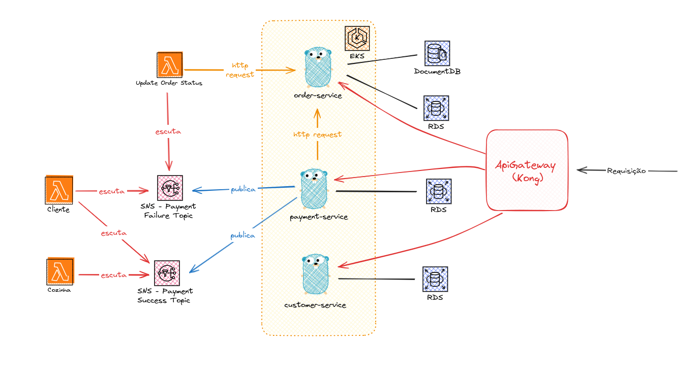
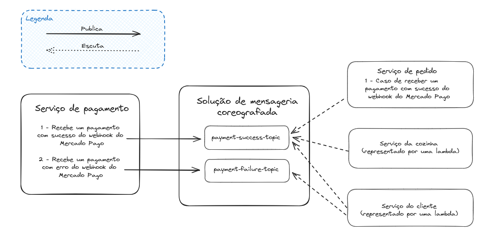
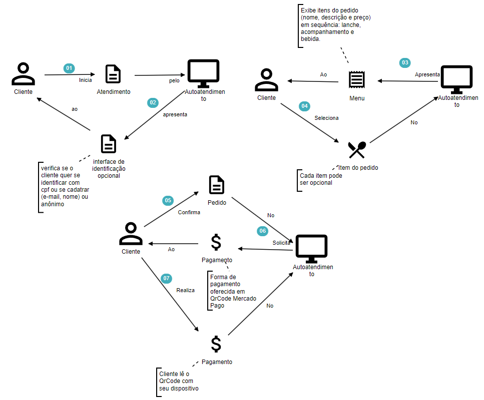
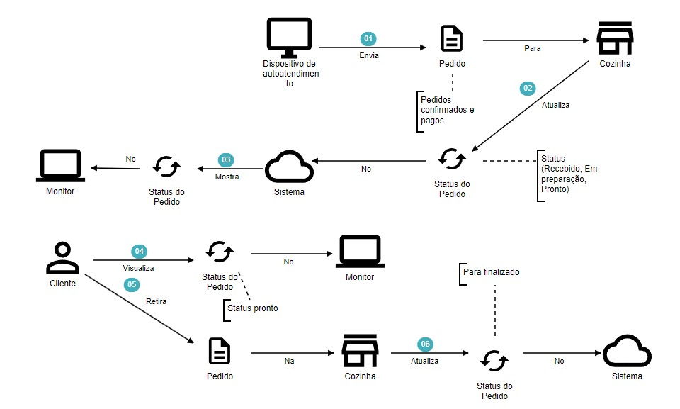

# FoodFusion - Fast Food FIAP - Tech Challenge

Este repositório FoodFusion é destinado ao projeto de Fast Food da FIAP, criado como parte de um desafio técnico.

## Objetivo do Projeto

O projeto de Fast Food da FIAP tem como objetivo criar um sistema de autoatendimento para uma lanchonete, visando melhorar a eficiência no atendimento aos clientes e garantir a precisão na preparação dos pedidos.

## Requisitos do Sistema

Para rodar a aplicação, é necessário ter as seguintes ferramentas instaladas:

- Docker
- Kubernetes
- K6 (para testes de estresse)

## Instruções para Rodar a Aplicação

1. **Configuração do Ambiente:**

   Certifique-se de ter o Docker e o Kubernetes configurados corretamente na sua máquina.

2. **Build da Imagem Docker:**

   Execute o seguinte comando para construir a imagem Docker da aplicação:

   ```bash
   docker build . -t tech-challenge-go -f Dockerfile
   ```

3. **Deploy com Kubernetes:**

   Aplique os recursos do Kubernetes utilizando o seguinte comando:

   ```bash
   kubectl apply -f infra/
   ```

4. **Verificação do Status dos Pods:**

   Aguarde até que todos os pods estejam rodando com o comando:

   ```bash
   kubectl get pods --watch
   ```

5. **Pronto.**

## Remoção de Recursos

Para apagar todos os recursos criados, utilize o comando:

```bash
kubectl delete -f infra/
```

## Testes de estresse

Para realizar testes de estresse, certifique-se de ter o K6 instalado na sua máquina e execute o seguinte comando:

```bash
k6 run --duration 1m tests/stress.js
```

## Documentação da API

Ao importar a documentação presente em `docs/tech-challenge.json` de cada repositório, no Postman, terão valores de exemplos editáveis.

## Documentação do problema

Para visualizar e editar o storytelling da aplicação, acesse [Egon.io](https://egon.io/app-v1/) e importe os arquivos `.dst` localizados em `docs/domain_storytelling`.

#### Relatório RIPD do sistema

É possível acessar o relatório RIPD atrávés do [link](docs/RIPD.docx).

#### Arquitetura do projeto



Esta imagem representa a arquitetura do sistema. Por conta de ser um projeto pequeno, com apenas um evento, foi decidido pelo padrão SAGA de coreografia. Isto é, o próprio serviço que mandará o evento (no caso, o payment-service).

#### Fluxograma dos microsserviços



Através da imagem podemos observar o comportamento entre os serviços, na parte de pagamento.

#### Pedido do Cliente



Esta imagem representa o processo de pedido do cliente usando o sistema de autoatendimento de fast food. Os clientes podem selecionar seus itens preferidos e personalizar seus pedidos de acordo com suas preferências.

#### Preparo e Entrega



Esta imagem representa o processo de preparo e entrega dos pedidos na cozinha da lanchonete. O sistema de autoatendimento de fast food transmite os pedidos automaticamente para a cozinha, após pagamento, onde são preparados e entregues aos clientes de forma eficiente e organizada.

### Explicação por vídeo

É possível ver pelo vídeo através do [link](https://youtu.be/SfEPL-rrXMs) o projeto rodando, inclusive com o padrão SAGA funcionando. Este projeto foi desenvolvido para gerenciar pedidos e pagamentos de um restaurante de forma eficiente e escalável. Explicando sobre o uso do padrão SAGA escolhido e sua justificativa, além de como a estrutura foi montada e como a comunicação está montada.

### Ordem de execução da API:

- Iniciar a aplicação, conforme presente nessa documentação.
- Se desejo criar um cliente, utilize o endpoint `POST /customers` e guarde o valor do customerId.
- Caso deseje utilizar um cliente já existente, pesquise o customerId através do endpoint `GET /customers?cpf=CPF_DO_CLIENTE`, informando o CPF do cliente.
- Liste as categorias de produtos utilizando o endpoint `GET /products/categories` para obter a categoryId, a ser utilizada na criação de produto.
- Crie um ou mais produtos através dos endpoints de `POST /products`.
- Para alterar um produto, utilize o endpoint `PATCH /products/:productId`.
- Para apagar um produto, utilize o endpoint `DELETE /products/:productId`.
- Liste os produtos criados através de `GET /products` para buscar os productId dos produtos que serão utilizados para criar um pedido.
- Crie um pedido, informando os productId dos produtos desejados, quantidade e observação (opcional), através do endpoint `POST /order`.
- Após criar o pedido, realize o pagamento por QR Code utilizando o endpoint `GET /payments/qr-code`.
- Para simular o pagamento em ambiente de teste, chame o endpoint de Webhook do Mercado Pago através de `POST /payments`. Assim, o pedido estará pago e recebido na cozinha.
- Utilize o endpoint `GET /orders` para listar os pedidos, que podem estar prontos, em preparação ou recebidos (e pagos).
- Quando um pedido precisar mudar de status, utilize o endpoint `PATCH /orders/:orderId` para alterar o status, de 'recebido' para 'em preparação', de 'em preparação' para 'pronto', e de 'pronto' para 'finalizado' (quando o cliente retirar o seu pedido).

## Pontos Importantes

Certifique-se de configurar corretamente as variáveis de ambiente e arquivos de configuração antes de rodar a aplicação.

<!--
## Contribuição
Este projeto está aberto para contribuições. Caso queira contribuir, por favor, faça um fork do repositório, implemente as alterações e envie um pull request.
-->

## Reports de vulnerabilidades

[Antes de executa o ZAP](docs/reports_vulnerabilidades/antes/2024-09-09-ZAP-Report.html)

[Depois de executa o ZAP](docs/reports_vulnerabilidades/depois/2024-09-09-ZAP-Report.html)

Nesses relatórios constam todos os registros de tentativas nos endpoints e também vulnerabilidades encontradas e quais foram tratadas

## Licença

Este projeto está licenciado sob a [Licença MIT](LICENSE).

## Referências

- [Documentação do Kubernetes](https://kubernetes.io/docs/)
- [Documentação do K6](https://k6.io/docs/)

<!--

**Here are some ideas to get you started:**

🙋‍♀️ A short introduction - what is your organization all about?
🌈 Contribution guidelines - how can the community get involved?
👩‍💻 Useful resources - where can the community find your docs? Is there anything else the community should know?
🍿 Fun facts - what does your team eat for breakfast?
🧙 Remember, you can do mighty things with the power of [Markdown](https://docs.github.com/github/writing-on-github/getting-started-with-writing-and-formatting-on-github/basic-writing-and-formatting-syntax)
-->
